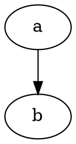

SeaPig
=====

SeaPig is converter from markdown to html with marked.js and highlight.js.


## Usage

SeaPig has two panes. Left pane is editor. Right pane is HTML previewer.

When you input new line, SeaPig refresh HTML preview.

SeaPig has tool bar contains one drop down list and five buttons.


You can select key bindings from drop down list. (default/emacs/vim)

Five buttons has feature below.

- Open markdown file to editor.
- Save markdown file from editor.
- Export HTML file from previewer.(At the same time css stylesheet is copied to same folder.)
- Export PDF file
- Refresh HTML preview

### viz.js support

When You write code block as `graphviz` language and write dot language, rendering graph image at svg as below.

<pre>

</pre>

to


### uiflow support

When You write code block as `uiflow` language and write uiflow language, rendering graph image at svg as below.

<pre>
```uiflow
[top page]
user name
password
--
login
==>mypage

[mypage]
favorite list
```
</pre>

to


## How to build

```
$ npm install --global-style
...
```

## How to lunch

```
$ npm start
```

## How to package (on Linux)

```
$ ./build.sh
```

## ToDo

- [x] save your favorite keybindings (default/emacs/vim)
- [x] support task list item.
- [x] add viz.js support
- [x] add [uiflow](https://github.com/hirokidaichi/uiflow) support.
- [ ] add simultaneous scroll
- [ ] add original menu
- [x] add new document
- [ ] add alternative stylesheet
- [x] control display editor and previewer
- [ ] add batch mode

## Special Thanks

- [Ace - The High Performance Code Editor for the Web](https://ace.c9.io/)(ace-min-noconflict)
- [Commander.js](https://github.com/tj/commander.js/)
- [Electron - Build cross platform desktop apps with JavaScript, HTML, and CSS.](http://electron.atom.io/)
- [electron-json-storage](https://github.com/jviotti/electron-json-storage)
- [Github Markdown CSS - for Markdown Editor Preview](https://gist.github.com/andyferra/2554919)
- [highlight.js](https://highlightjs.org/)
- [marked](https://github.com/chjj/marked)
- [Node.js](https://nodejs.org/en/)
- [Photon](http://photonkit.com/)
- [viz.js](https://github.com/mdaines/viz.js)
- [uiflow](https://github.com/hirokidaichi/uiflow)(use [forked version](https://github.com/tkrkt/uiflow#fix-argument-in-compile))
- [いらすとや](http://www.irasutoya.com/)(application icon)

# License

MIT (excludes photon, node_modules and icons)

Copyright &copy; 2016 Yasumichi Akahoshi

# Icons copyright

- seapig.icns
- seapig.ico
- seapig.png

Copyright &copy; いらすとや. All Rights Reserved.
