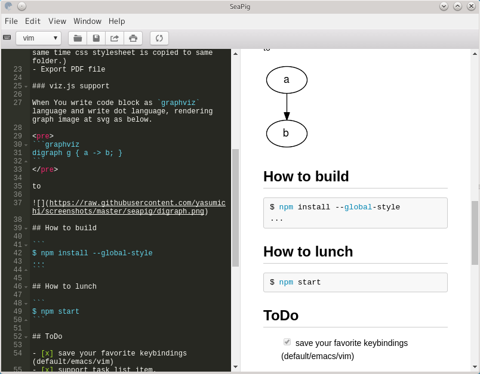
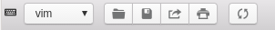
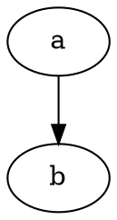
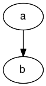
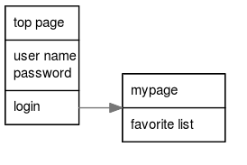
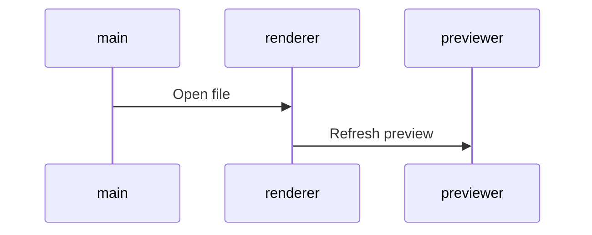
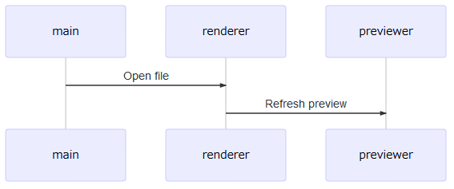

SeaPig
=====

SeaPig is converter from markdown to html with marked.js and highlight.js.



## Usage

SeaPig has two panes. Left pane is editor. Right pane is HTML previewer.

When you input markdown, SeaPig refresh HTML preview.

You can use [GitHub Flavored Markdown](https://github.github.com/gfm/).

SeaPig has tool bar contains one drop down list and eight buttons.



You can select key bindings from drop down list. (default/emacs/vim/sublime)

Eight buttons has feature below.

- New markdown file (Open new window)
- Open markdown file to editor.
- Save markdown file from editor.
- Export HTML file from previewer.(At the same time css stylesheet is copied to same folder.)
- Export PDF file
- Hide editor
- Hide previewer
- Refresh HTML preview

### viz.js support

When You write code block as `graphviz` language and write dot language, rendering graph image at svg as below.

<pre>

</pre>

to



### uiflow support

When You write code block as `uiflow` language and write uiflow language, rendering graph image at svg as below.

<pre>
```uiflow
[top page]
user name
password
--
login
==>mypage

[mypage]
favorite list
```
</pre>

to



### mermaid support (flowchart, sequence, gantt)

When You write code block as `mermaid` language and write mermaid language, rendering graph image at svg as below.

<pre>

</pre>

to



## For developers

### How to build

```
$ npm install
$ npm build-dep
...
```

### How to lunch

```
$ npm start
```

### How to package

```
$ npm run package:win32
```

### How to package all (on Linux)

```
$ ./build.sh
```

## ToDo

- [x] save your favorite keybindings (default/emacs/vim)
- [x] support task list item.
- [x] add viz.js support
- [x] add [uiflow](https://github.com/hirokidaichi/uiflow) support.
- [x] add mermaid support
- [x] add simultaneous scroll
- [x] add original menu
- [x] add new document
- [ ] add alternative stylesheet
- [x] control display editor and previewer
- [ ] add batch mode
- [x] introduce virtual dom framework (mithril.js)

## Special Thanks

- [Ace - The High Performance Code Editor for the Web](https://ace.c9.io/)
- [Electron - Build cross platform desktop apps with JavaScript, HTML, and CSS.](http://electron.atom.io/)
- [electron-json-storage](https://github.com/jviotti/electron-json-storage)
- [Github Markdown CSS - for Markdown Editor Preview](https://gist.github.com/andyferra/2554919)
- [highlight.js](https://highlightjs.org/)
- [marked](https://github.com/chjj/marked)
- [mermaid](https://knsv.github.io/mermaid/)
- [mithril](https://mithril.js.org/)
- [Node.js](https://nodejs.org/en/)
- [Photon](http://photonkit.com/)
- [sanitize-html](https://github.com/apostrophecms/sanitize-html)
- [viz.js](https://github.com/mdaines/viz.js)
- [uiflow](https://github.com/hirokidaichi/uiflow)(use [forked version](https://github.com/tkrkt/uiflow#fix-argument-in-compile))
- [いらすとや](http://www.irasutoya.com/)(application icon)

# License

MIT (excludes photon, node_modules and icons)

Copyright &copy; 2016-2019 Yasumichi Akahoshi

# Icons copyright

- seapig.icns
- seapig.ico
- seapig.png

Copyright &copy; いらすとや. All Rights Reserved.
